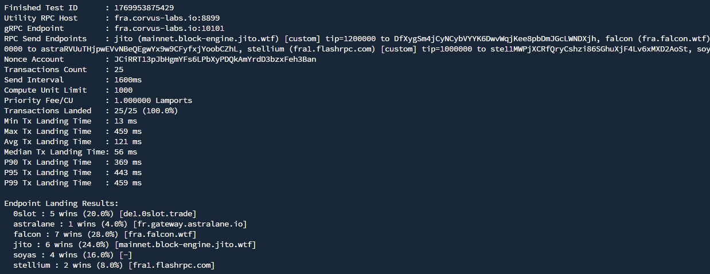

# LandingBench

LandingBench benchmarks how fast Solana forwarders land durable nonce transactions. It sends the same nonce-based transaction to each endpoint, tags the transaction with the endpoint name plus a random payload using a noop program, and uses a single gRPC stream to attribute landings.



## Highlights

- Benchmark multiple endpoints per round with configurable delay.
- Durable nonce flow with optional compute budget and tips.
- Single gRPC listener attributes landings by endpoint tag.
- Prints per-endpoint landing counts and latency percentiles.

## Quick Start

```bash
cargo build --release
./target/release/landingbench
```

First run creates `config.toml`. Edit it with your endpoints, nonce account, and payer private key.

### CLI options

- `--config <PATH>` load a custom config file (default: `config.toml`)
- `-h, --help` show usage

## Configuration

LandingBench reads a single TOML file:

```toml
[config]
utility_rpc = "https://api.mainnet-beta.solana.com"
transactions = 100
delay_ms = 1600
nonce_account = "<nonce account>" # https://docs.anza.xyz/cli/examples/durable-nonce/#nonce-account-creation
private_key = "<base58 keypair>" # signer / nonce authority
commitment = "processed"         # processed | confirmed | finalized
landing_grace_ms = 10000
prio_fee = 0.1                   # lamports per CU
compute_unit_limit = 1000

[grpc]
name = "listener"
url = "http://fra.corvus-labs.io:10101"
kind = "yellowstone"
# x_token = "optional-token"

[[endpoint]]
name = "rpc"
url = "http://fra.corvus-labs.io:8899"
kind = "rpc"

[[endpoint]]
name = "jito"
url = "https://mainnet.block-engine.jito.wtf/api/v1/transactions?uuid=redacted"
kind = "custom"
tip_lamports = 1000000
tip_wallet = "DfXygSm4jCyNCybVYYK6DwvWqjKee8pbDmJGcLWNDXjh"

[[endpoint]]
name = "falcon"
url = "http://fra.falcon.wtf/?api-key=redacted"
kind = "custom"
tip_lamports = 1000000
tip_wallet = "Fa1con1zUzb6qJVFz5tNkPq1Ahm8H1qKW7Q48252QbkQ"

[[endpoint]]
name = "0slot"
url = "https://de1.0slot.trade?api-key=redacted"
kind = "custom"
tip_lamports = 1000000
tip_wallet = "7toBU3inhmrARGngC7z6SjyP85HgGMmCTEwGNRAcYnEK"

[[endpoint]]
name = "soyas"
url = "fra.landing.soyas.xyz:9000"
kind = "soyas"
api_key = "redacted"
tip_wallet = "soyascXFW5wEEYiwfEmHy2pNwomqzvggJosGVD6TJdY"
tip_lamports = 1000000
```

Notes:
- `transactions` is the number of rounds. Each round sends one tx per endpoint.
- `prio_fee` is in lamports per CU (converted to micro-lamports internally).
- `landing_grace_ms` controls how long to wait for late landings after sends finish.
- Output logs show hostnames only (query params like api keys are not logged).

## How it works

1. Fetch a fresh durable nonce hash and build a transaction that includes:
   - `AdvanceNonceAccount`
   - Optional compute budget instructions (if `prio_fee > 0`)
   - A noop program instruction with payload `endpoint|random`
   - Optional tip transfer for `custom` and `soyas` endpoints
2. Send the transaction to each endpoint in parallel.
3. A Yellowstone gRPC stream watches the nonce account, extracts the payload, and attributes the landing to the correct endpoint.
4. Latency is measured from send time to first observation; results are printed per endpoint.

## Security

`private_key` is a base58-encoded keypair that can pays for the forwarder tips. Make sure to use a burner with a small amount of SOL.
